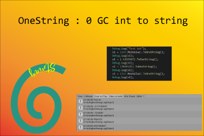

## 

[OneString]( https://assetstore.unity.com/packages/slug/168465 
) 是一个 0 GC ToString 和 0 GC String.Cancat 解决方案。传统的数字或者bool变量转换成string的时候会产生GC。由于string是不可变的，每次都该string的值，内部都会生成一个新的string。如果我们需要临时打印某个值，使用系统提供的 ToString 函数就会不可避免地产生一个新的string，我们其实并不需要保存这个string的值，仅仅是为了打印一下，这是我们不想看到的结果。因此如果有一个临时字符串在我们使用之后，自动回收重复利用，并且不会产生GC就好了。OneString 就是这样一个解决方案。不过需要注意的是像 UGUI 的Text 组件里面的值，这种需要用来显示使用的，不要使用此方案，因为Text的值会被修改掉。

## 特点

- 0 GC：To String 不会产生 GC。 
- 0 GC：String.Concat 不会产生 GC。
- 支持 int、long、float、double、bool 等。 
- 支持设置浮点数的精度，默认是保留小数点后两位。
- 便于使用：直接使用 ToOneString() 函数即可，它会返回一个临时string。
- 支持扩展和修改。
- 包含完整的代码和demo场景。 

## 安装

Player Settings: 勾选 Allow ‘unsafe’ Code 。

                                      

直接使用 ToOneString() 即可，它会返回一个临时字符串string。

## 文档

[PDF](./Doc/README.pdf)

## Release Note

### 2.0.1

- 增加 0 GC OneString.Concat, 返回的是OneString临时字符串
- Float 保留小数点后4位（可以自己设置）
- 代码命名规范

### 1.0.1

Init release 

## 联系

更多信息，请看网站:   https://assetstore.unity.com/packages/slug/168465 

Email: [936496193@qq.com](mailto:936496193@qq.com)
